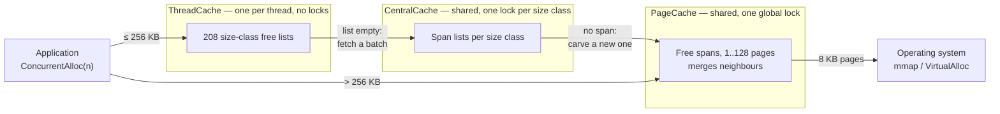
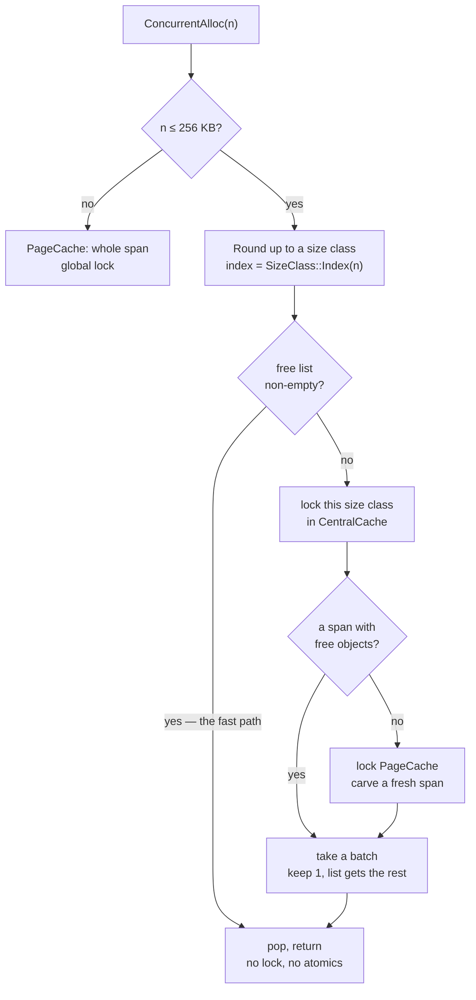

# A thread-caching memory allocator

A from-scratch `malloc` replacement in C++, built along the lines of Google's
**tcmalloc**: per-thread free lists on the fast path, batched refills through a
shared middle layer, and a page-level backend that talks straight to the OS.

About **1 200 lines** across 12 files, plus a benchmark harness. Solo project
(Northeastern CS5600, Nov 2025).

The interesting part is not that it beats the system allocator on a benchmark.
It is **which** benchmarks it wins, which it loses, and what that says about
where the speed actually comes from — the answer turned out not to be the one I
set out to demonstrate.

---

## Architecture

Three layers. An allocation is served by the shallowest one that can satisfy it,
and only the deepest layer ever asks the OS for memory.



| Layer | Scope | Synchronisation | Job |
| --- | --- | --- | --- |
| `ThreadCache` | per thread | **none** | Pop/push a free list. The whole point. |
| `CentralCache` | global | one mutex **per size class** | Hand out batches of objects carved from spans. |
| `PageCache` | global | one global mutex | Get pages from the OS, split and merge spans. |

The layering is what makes the fast path lock-free: a thread only reaches shared
state when its own free list runs dry, and when it does, it takes enough objects
to amortise the trip.

### The fast path, and what it costs to miss it



Two details worth calling out.

**Batched refills with slow start.** When a free list is empty the thread does
not fetch one object, it fetches a batch — and the batch size grows each time
that list is refilled (`MaxSize()` climbs by one per refill). A thread that
allocates a handful of objects never pays for a large transfer; a thread in a hot
loop converges on large ones. Same idea as TCP slow start.

**Size classes trade a little memory for a lot of speed.** 208 classes with
alignment that widens as sizes grow, so the worst-case waste stays near 12%:

```
     1 ..   128 B   ->  8 B alignment    16 classes
   129 .. 1024 B    -> 16 B alignment    56 classes
  1 KB ..    8 KB   -> 128 B alignment   56 classes
  8 KB ..   64 KB   ->   1 KB alignment  56 classes
 64 KB ..  256 KB   ->   8 KB alignment  24 classes
      > 256 KB      -> whole pages, straight to PageCache
```

Rounding to a class is a couple of shifts, so both `Index` and `RoundUp` are
branch-on-magnitude then arithmetic — no search.

### Spans, and how a pointer finds its way home

A **span** is a run of consecutive 8 KB pages. `CentralCache` chops a span into
equal objects of one size class; `PageCache` owns whole spans and merges
neighbours back together as they are freed, which is what stops the heap
fragmenting into unusable gaps.

```
span: 4 pages, size class 128 B
+--------+--------+--------+--------+
| page N | page+1 | page+2 | page+3 |
+--------+--------+--------+--------+
 \___________________________________/
   sliced into 256 objects, threaded
   onto a singly-linked free list

free(p) has no size argument, so:

  pageId = (uintptr_t)p >> 13   ------>  page map  ------>  Span*
                                                              |
                                                    span->_objSize
                                                    tells us the size class
```

`free` receives only a pointer, so the allocator has to recover the size itself.
Every page belongs to exactly one span, so shifting the pointer down by the page
size gives a key into a **page map** that returns the owning span — and the span
records its object size. That lookup happens on **every** deallocation, which
makes it the single hottest data structure in the design. It is also where the
port went wrong.

---

## Porting it to 64-bit broke it, instructively

The project was originally built 32-bit on Windows (`-A Win32`). Moving it to
64-bit macOS/Linux took the obvious changes — `mmap`/`munmap` for
`VirtualAlloc`/`VirtualFree`, `thread_local` for `_declspec(thread)`, a 64-bit
`PAGE_ID` — and then it segfaulted on the first `free`.

The page map was this:

```cpp
TCMalloc_PageMap1<32 - PAGE_SHIFT> _idSpanMap;   // 2^19 entries, flat array
```

A flat array of 2^19 slots covers page IDs 0 through 2^19, which is the low
**4 GB** of address space. On a 32-bit build that is the entire address space. On
a 64-bit host `mmap` returns addresses well above 4 GB, every page ID fails the
array's bound check, `get()` returns null for perfectly valid pointers, and the
first deallocation dereferences it.

The fix is the one real tcmalloc makes: choose the map's depth from the width of
the address space. With 48-bit user addresses and 8 KB pages there are 2^35 page
IDs to cover. A two-level split puts 2^18 entries in a leaf — **2 MB per node**,
which then tripped a second bug, because `ObjectPool` refills in fixed 128 KB
chunks and hands out a 2 MB object from a 128 KB block without complaint. So:
**three levels**, 12/12/11 bits, every node 16–32 KB, allocated lazily and
straight from the OS rather than through the pool.

Node pointers are `std::atomic` with release stores and acquire loads. `get()`
runs on the free path without the `PageCache` lock, so it can genuinely race a
concurrent `set()`; nodes are never freed, so a published pointer stays valid,
and the acquire/release pairing is what guarantees a reader that sees a node also
sees its zeroed contents.

Two other real bugs surfaced on the way:

- `FetchFromCentralCache` fell off the end of a non-`void` function when its
  batch came back empty. An `assert` covered the case in debug builds and
  vanished under `-DNDEBUG`, leaving undefined behaviour in exactly the
  configuration you benchmark.
- Headers were included before the declarations their templates depended on.
  MSVC accepts this; clang and GCC correctly do not.

---

## What the measurements actually show

Full tables and commands in [BENCHMARKS.md](BENCHMARKS.md). Apple M3 Pro, macOS,
baseline is **macOS libmalloc**, wall clock, median of 15 runs, warm-up
discarded. Headline figures are given as ranges over several independent
measurements: run-to-run spread on this machine is 20-30%, so single numbers
carry false precision.

An earlier round of this project measured against the **Windows CRT** allocator
and reported up to 22.8x. That number is not wrong so much as uninformative: the
Windows CRT heap serialises on a global lock and is the weakest baseline
available. libmalloc already keeps per-thread magazines, so it is a real
opponent. Every figure below is against libmalloc.

### Finding 1 — the speed is in the fast path, not in avoiding locks

Five independent measurements at each end, each itself a median of 15 runs:

| threads | speedup range | median |
| --- | --- | --- |
| 1 | 3.14x – 4.60x | 3.87x |
| 8 | 4.01x – 5.29x | 4.43x |

I built this expecting to demonstrate that per-thread caching wins by removing
lock contention. If that were the mechanism, one thread would show roughly no
advantage and the gap would open up with concurrency.

It does not. **A single thread already shows the full effect**, and the two ranges
overlap heavily — there is no scaling trend here that survives the run-to-run
noise on this machine. Whatever this allocator is doing better, it is doing it
per call, not by staying out of a lock: popping a pointer off a thread-local list
is simply cheaper than what libmalloc does per allocation.

That is a stronger version of the claim than "most of the win is single-threaded",
because I cannot resolve a contention benefit at all at these thread counts.

Getting this right required a single-threaded baseline, which the original
experiments did not have. It is the measurement that changed the conclusion.

### Finding 2 — there is exactly one workload it loses, and the cost is countable

Five independent measurements each, 4 threads, bounded 64-object live set:

| size distribution | speedup range | median |
| --- | --- | --- |
| fixed 16 B | 2.06x – 2.71x | 2.60x |
| random 1 B–8 KB | 3.23x – 3.89x | 3.75x |
| **ramp 1 B–8 KB** (ascending) | **0.65x – 0.82x** | **0.80x** |

No range crosses 1.0, so the win/win/lose split is solid even though the exact
figures move by 20-30% between runs.

A bounded live set is not what hurts it — that is the realistic pattern, and it
wins two of the three size distributions there. The loss is specific to
**ascending sizes combined with a bounded live set**, and `ramp` and `random`
draw from the *same* 1 B–8 KB range, so the distribution alone does not explain
it either.

Counters compiled in behind `-DALLOC_STATS` say what does. The obvious guess —
that the fast path collapses — is wrong: `ramp/interleaved` still serves **95%**
of allocations from the thread-local list, and `ramp/bulk` has a *lower* hit rate
(93.6%) while running 4.8x **faster** than malloc. Hit rate is not the variable.

The number of trips to `CentralCache` is:

| workload | central-cache round trips per 1 000 allocations | ours, median (ms) |
| --- | --- | --- |
| fixed / interleaved | 0.8 | 0.88 |
| random / interleaved | 18.3 | 1.85 |
| ramp / interleaved | **86.8** | 3.41 |

A hundredfold difference in trips to the shared layer, in the same monotonic order
as the cost. Fitting `time = a x allocations + b x central_trips` on the first and
third rows puts **a at roughly 2 ns** per fast-path allocation and **b at roughly
70 ns** per round trip — a locked trip through the shared layer costs something
like **30x** a local pop.

Treat those as an order-of-magnitude decomposition, not a predictive model. Held
out the middle row and the fit under-predicts it by 25%, outside its measured
spread, so central trips are clearly the dominant term but not the only one — the
random case scatters across ~130 size classes' worth of free lists and pays cache
misses the ramp does not. (An earlier version of this README quoted a 1.5%
prediction error from a single sample. It did not survive repetition.)

Why does the ramp force 100x more round trips than a fixed size? Because
`MaxSize()` does double duty: it is the refill batch size *and* the threshold at
which `Deallocate` flushes a list back to `CentralCache`. With a 64-object window
and ascending sizes, allocation and deallocation are always working on
**different** size classes — allocations pull from class `C_i` while frees push
into `C_i-64`, which the ramp has already left behind. Nothing a thread frees ever
replenishes what it is about to allocate, so every object makes a full round trip
through the shared layer: fetched for one class, flushed for another. With random
sizes, a freed object lands in a class that will be allocated from again shortly,
so it gets recycled locally and never leaves the thread.

The fast-path *rate* stays high the whole time because the ramp lingers in each
class for 8, 16, or 128 consecutive allocations (the alignment granularity), so
one batch of ~13 covers most of them. High hit rate, high absolute miss count —
which is why the rate misled me and the counters did not.

The other half of the gap is not about this allocator at all: libmalloc runs
`ramp/interleaved` in 3.48 ms but `random/interleaved` in 5.18 ms, so it is
*faster* on the ramp than on random sizes. The ratio flips because our worst case
and libmalloc's best case happen to be the same workload.

(The cost model only holds for the bounded-live-set family. Under `bulk`, 10 000
simultaneously live objects add cache and page-fault costs it does not capture —
it underpredicts `fixed/bulk` by 83%.)

One note of precision the original write-up got wrong: it called this ramp
"random-sized allocations". A deterministic ascending sweep is not neutral for a
size-class allocator — it is the one shape that defeats local recycling.

### Finding 3 — tail latency follows the fast path, it is not a separate win

Throughput answers "how long do 400 000 calls take". It says nothing about the
worst call in a thousand, which is what a latency-sensitive service cares about.
So: time one call in ~16, randomised so the sampling cannot alias with periodic
slow paths, and take percentiles. (The clock itself costs 16–26 ns here, about
10x the fast path, which is why sampling rather than full instrumentation — and
why p50 is not resolvable for either allocator.)

I expected this to be a clean win. This allocator's whole-run variance is lower
than libmalloc's, and it seemed to follow that its calls would be steadier.

They are not, and the split is the same one as Finding 2:

| workload | throughput | p99 (alloc) |
| --- | --- | --- |
| random / interleaved | ours 3.8x | ours 67 ns vs 234 ns — **ours better** |
| ramp / bulk | ours 4.4x | ours 649 ns vs 1 483 ns — **ours better** |
| fixed / interleaved | ours 2.6x | 64 ns vs 23 ns — roughly tied |
| **ramp / interleaved** | **ours 0.8x** | **485 ns vs 110 ns — malloc better** |

At p99.9 on that last row it is **9 842 ns against 610 ns, 16x worse**. The slow
path here is a cascade — free list empty, then the CentralCache lock, then the
PageCache lock, then possibly an `mmap` syscall — and the ramp drives it
constantly. libmalloc's refill is shallower and bounded.

So there is no independent "more predictable" property to claim. **Tail latency
is governed by the same thing as throughput: how often you fall off the fast
path.** A whole-run standard deviation hints at that but cannot measure it, and
on the one workload where it mattered, it pointed the wrong way.

One number worth keeping: libmalloc's worst single `free` was **592 µs**. That is
what returning memory to the OS costs — the same behaviour that makes it use 11x
less memory in Finding 4. This allocator never returns anything under 1 MB, so it
never pays that spike. Footprint and tail latency are one trade-off seen from two
sides.

### Finding 4 — the memory cost is much larger than "some overhead"

Peak RSS, one allocator per process:

| size / pattern | ours | libmalloc | ratio |
| --- | --- | --- | --- |
| fixed 16 B / interleaved | 2.8 MB | 2.6 MB | 1.08x |
| ramp / bulk | 221 MB | 136 MB | 1.63x |
| **ramp / interleaved** | **128 MB** | **11 MB** | **11.58x** |

The same lack of local recycling shows up as memory. Roughly 130 size classes each accumulate a
free list that is never drawn from again, and `PageCache` only returns a span to
the OS when it is 128 pages or larger — so for this workload nothing is ever
given back. libmalloc holds 11 MB for the same 64 live objects.

For a single size class the overhead is nil (1.08x). The cost is not per-thread
caching as such; it is **size-class spread with no reclamation**.

---

## Where real tcmalloc goes further

The core ideas here are the real ones — thread-local free lists, slow-start
batching, per-size-class locks, span merging, page-to-span mapping. What
production tcmalloc adds, mapped onto the problems the measurements above found:

| Mechanism | Problem it solves | Here |
| --- | --- | --- |
| **Per-CPU caches** (restartable sequences) | Cache count scales with cores, not threads — the main lever on Finding 4 | per-thread |
| **Returning memory to the OS** | Idle free lists and spans stop being resident | only spans >1 MB |
| **Transfer cache** | Smooths cross-thread frees so neither side keeps hitting the central layer | absent (the 2.50x cross-thread case) |
| **Adaptive cache sizing / periodic scavenging** | Free lists a workload has stopped using shrink back, instead of `MaxSize()` forcing a flush | `MaxSize()` only grows |
| **Sized delete** (`operator delete(p, n)`) | Skips the page-map lookup when the caller knows the size | always looks up |
| **Hugepage-aware backend** (Temeraire) | Fewer TLB misses on large heaps | 8 KB pages |
| **Sampling heap profiler** | Attributing allocations in production | absent |

---

## Build and run

Needs a C++14 compiler. No dependencies.

```bash
c++ -std=c++14 -O2 -DNDEBUG -pthread -o bench \
    main.cpp CentralCache.cpp PageCache.cpp ThreadCache.cpp
```

```bash
./bench --help
./bench --threads 4 --size ramp --pattern bulk --reps 15
./bench --threads 1 --size random --pattern interleaved   # the case it loses
./bench --size ramp --pattern interleaved --only mine     # peak RSS in isolation
./bench --latency --lat-stride 16 --size ramp --pattern interleaved  # p99 / p99.9
```

| Flag | Meaning |
| --- | --- |
| `--threads N` | worker threads |
| `--rounds N` / `--ntimes N` | rounds per thread / allocations per round |
| `--reps N` | repetitions, reported as median + standard deviation |
| `--size` | `fixed` \| `ramp` \| `random` \| `large` |
| `--pattern` | `bulk` \| `interleaved` \| `cross` |
| `--only` | `mine` \| `sys` \| `both` — one allocator per process, for RSS |
| `--latency` | per-call latency percentiles instead of throughput |
| `--lat-stride N` | mean gap between latency samples (default 64) |
| `--csv` | machine-readable output |

Worth building with sanitizers before trusting any timing — an allocator that is
fast and subtly wrong is worthless:

```bash
c++ -std=c++14 -O1 -g -pthread -fsanitize=address \
    -o bench_asan main.cpp CentralCache.cpp PageCache.cpp ThreadCache.cpp
./bench_asan --threads 4 --rounds 3 --ntimes 300 --pattern cross
```

---

## Limitations

Course project, not a drop-in allocator:

- **Not a `malloc` replacement.** It is called explicitly as
  `ConcurrentAlloc`/`ConcurrentFree`. There is no `operator new` override, no
  `LD_PRELOAD` shim, and no `realloc`, `calloc`, `posix_memalign`, or
  `malloc_usable_size`.
- **No alignment guarantees beyond 8 bytes.** No over-aligned type support.
- **Memory is essentially never returned to the OS** — only spans of 128+ pages.
  Finding 4 is the consequence.
- **Slower than the system allocator on one measured workload** — ascending
  sizes with a bounded live set, 0.65-0.82x. Finding 2 quantifies why. On a
  bounded live set with fixed or random sizes it is 2.1-3.9x faster.
- **No unit tests.** Correctness was checked with AddressSanitizer and
  assert-enabled debug builds across the workload matrix, which is not the same
  thing as a test suite.
- **The page map's lock-free reads are only safe because nodes are never freed.**
  Adding reclamation would need real memory ordering work or hazard pointers.
- **Single machine, single baseline.** All numbers are one Apple M3 Pro against
  macOS libmalloc. glibc's ptmalloc, jemalloc, mimalloc and real tcmalloc would
  all behave differently, and the honest comparison for a "tcmalloc-style"
  allocator is against tcmalloc itself — which I have not run.
- **Run-to-run variance is not a tail-latency result.** `libmalloc`'s standard
  deviation across whole runs is high, but that is a statement about 400 000
  operations in aggregate. Measured per call (Finding 3), the tail goes the other
  way on this allocator's worst workload.
- **`libmalloc`'s run-to-run variance is high** (standard deviation often 30–50%
  of its median under load) even with warm-up and alternated ordering. Medians
  over 15 repetitions are reported for that reason; single runs are not
  meaningful.
