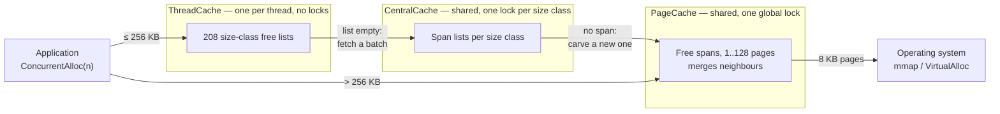
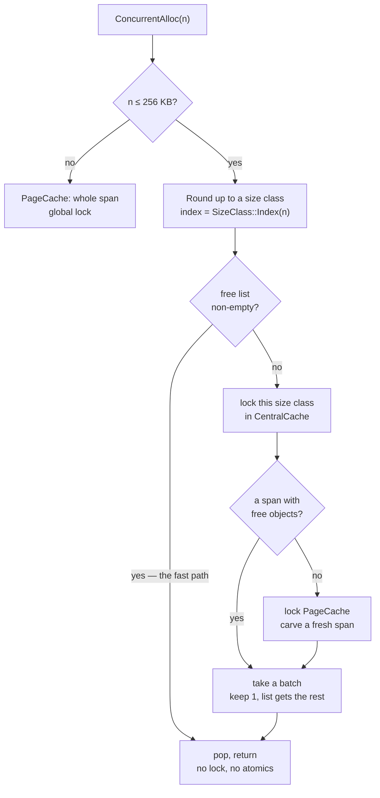

# A thread-caching memory allocator

A from-scratch `malloc` replacement in C++, built along the lines of Google's
**tcmalloc**: per-thread free lists on the fast path, batched refills through a
shared middle layer, and a page-level backend that talks straight to the OS.

About **1 200 lines** across 12 files, plus a benchmark harness. Solo project
(Northeastern CS5600, Nov 2025).

The interesting part is not that it beats the system allocator on a benchmark.
It is **which** benchmarks it wins, which it loses, and what that says about
where the speed actually comes from — the answer turned out not to be the one I
set out to demonstrate.

---

## Architecture

Three layers. An allocation is served by the shallowest one that can satisfy it,
and only the deepest layer ever asks the OS for memory.



| Layer | Scope | Synchronisation | Job |
| --- | --- | --- | --- |
| `ThreadCache` | per thread | **none** | Pop/push a free list. The whole point. |
| `CentralCache` | global | one mutex **per size class** | Hand out batches of objects carved from spans. |
| `PageCache` | global | one global mutex | Get pages from the OS, split and merge spans. |

The layering is what makes the fast path lock-free: a thread only reaches shared
state when its own free list runs dry, and when it does, it takes enough objects
to amortise the trip.

### The fast path, and what it costs to miss it



Two details worth calling out.

**Batched refills with slow start.** When a free list is empty the thread does
not fetch one object, it fetches a batch — and the batch size grows each time
that list is refilled (`MaxSize()` climbs by one per refill). A thread that
allocates a handful of objects never pays for a large transfer; a thread in a hot
loop converges on large ones. Same idea as TCP slow start.

**Size classes trade a little memory for a lot of speed.** 208 classes with
alignment that widens as sizes grow, so that rounding a request up to its class
wastes at most ~11% of the block **for requests above 128 bytes**:

```
     1 ..   128 B   ->  8 B alignment    16 classes
   129 .. 1024 B    -> 16 B alignment    56 classes
  1 KB ..    8 KB   -> 128 B alignment   56 classes
  8 KB ..   64 KB   ->   1 KB alignment  56 classes
 64 KB ..  256 KB   ->   8 KB alignment  24 classes
      > 256 KB      -> whole pages, straight to PageCache
```

Rounding to a class is a couple of shifts, so both `Index` and `RoundUp` are
branch-on-magnitude then arithmetic — no search.

Two things that bound is *not*, because both are easy to read into it:

- **It does not hold at the bottom of the range.** An 8-byte quantum on a 1-byte
  request wastes 87.5%. The ~11% figure is the worst case within each band
  *above* 128 bytes (10.4%, 11.0%, 11.1%, 11.1% respectively).
- **It is not this allocator's memory overhead.** It bounds the gap *inside* a
  block that has been handed to the application. It says nothing about memory the
  allocator is holding and has not handed out, which is where the footprint
  actually goes. On the `ramp/interleaved` workload the two differ by three orders
  of magnitude:

  | | |
  | --- | --- |
  | live application data (256 objects, mean 3 574 B) | **0.87 MB** |
  | of which rounding waste (measured, 1.5% here) | 0.04 MB |
  | libmalloc's peak RSS for the same work | 7 MB — **8x** live |
  | **this allocator's peak RSS** | **137 MB — 157x live** |

  A few times the live set is normal for an allocator; libmalloc is at 8x. 157x is
  the retention problem in Finding 6 — free lists that never shrink, spans pinned
  by a single live object, and a PageCache that returns nothing under 1 MB. None of
  that is rounding, and no size-class tuning would fix it.

### Spans, and how a pointer finds its way home

A **span** is a run of consecutive 8 KB pages. `CentralCache` chops a span into
equal objects of one size class; `PageCache` owns whole spans and merges
neighbours back together as they are freed, which is what stops the heap
fragmenting into unusable gaps.

```
span: 4 pages, size class 128 B
+--------+--------+--------+--------+
| page N | page+1 | page+2 | page+3 |
+--------+--------+--------+--------+
 \___________________________________/
   sliced into 256 objects, threaded
   onto a singly-linked free list

free(p) has no size argument, so:

  pageId = (uintptr_t)p >> 13   ------>  page map  ------>  Span*
                                                              |
                                                    span->_objSize
                                                    tells us the size class
```

`free` receives only a pointer, so the allocator has to recover the size itself.
Every page belongs to exactly one span, so shifting the pointer down by the page
size gives a key into a **page map** that returns the owning span — and the span
records its object size. That lookup happens on **every** deallocation, which
makes it the single hottest data structure in the design. It is also where the
port went wrong.

---

## Porting it to 64-bit broke it, instructively

The project was originally built 32-bit on Windows (`-A Win32`). Moving it to
64-bit macOS/Linux took the obvious changes — `mmap`/`munmap` for
`VirtualAlloc`/`VirtualFree`, `thread_local` for `_declspec(thread)`, a 64-bit
`PAGE_ID` — and then it segfaulted on the first `free`.

The page map was this:

```cpp
TCMalloc_PageMap1<32 - PAGE_SHIFT> _idSpanMap;   // 2^19 entries, flat array
```

A flat array of 2^19 slots covers page IDs 0 through 2^19, which is the low
**4 GB** of address space. On a 32-bit build that is the entire address space. On
a 64-bit host `mmap` returns addresses well above 4 GB, every page ID fails the
array's bound check, `get()` returns null for perfectly valid pointers, and the
first deallocation dereferences it.

The fix is the one real tcmalloc makes: choose the map's depth from the width of
the address space. With 48-bit user addresses and 8 KB pages there are 2^35 page
IDs to cover. A two-level split puts 2^18 entries in a leaf — **2 MB per node**,
which then tripped a second bug, because `ObjectPool` refills in fixed 128 KB
chunks and hands out a 2 MB object from a 128 KB block without complaint. So:
**three levels**, 12/12/11 bits, every node 16–32 KB, allocated lazily and
straight from the OS rather than through the pool.

Node pointers are `std::atomic` with release stores and acquire loads. `get()`
runs on the free path without the `PageCache` lock, so it can genuinely race a
concurrent `set()`; nodes are never freed, so a published pointer stays valid,
and the acquire/release pairing is what guarantees a reader that sees a node also
sees its zeroed contents.

Two other real bugs surfaced on the way:

- `FetchFromCentralCache` fell off the end of a non-`void` function when its
  batch came back empty. An `assert` covered the case in debug builds and
  vanished under `-DNDEBUG`, leaving undefined behaviour in exactly the
  configuration you benchmark.
- Headers were included before the declarations their templates depended on.
  MSVC accepts this; clang and GCC correctly do not.

---

## What the measurements actually show

Full tables and commands in [BENCHMARKS.md](BENCHMARKS.md). Apple M3 Pro, macOS,
baseline is **macOS libmalloc**, wall clock, median of 15 runs, warm-up
discarded. Headline figures are given as ranges over several independent
measurements: run-to-run spread on this machine is 20-30%, so single numbers
carry false precision.

An earlier round of this project reported up to **22.8x** against the Windows CRT
allocator. That figure is superseded twice over: it came from a 32-bit build whose
page map is a different data structure, and re-measured on x64 the same workload
reads **9.52x**. More to the point, it was never informative — the choice of
baseline turns out to matter more than the choice of workload (Finding 2).

Five allocators across three operating systems:

| baseline | platform | notes |
| --- | --- | --- |
| **macOS libmalloc** | Apple M3 Pro, macOS 15 | per-thread magazines; the default figures below |
| **glibc ptmalloc 2.35** | Ubuntu 22.04 aarch64, 4 cores | per-thread arenas + tcache; the baseline the original write-up discussed and never measured |
| **Windows UCRT malloc** | Ryzen 7 7700X, Win 10 x64, MSVC 19.42 | forwards to the process heap |
| **mimalloc 3.4.5** | Windows x64 | Microsoft's allocator, injected and verified |
| **gperftools tcmalloc 2.18** | all three OSes, same `--enable-minimal` build | the architecture this project copies — the only real peer here |

### Finding 1 — the speed is in the fast path, not in avoiding locks

Five independent measurements at each end, each itself a median of 15 runs:

| threads | speedup range | median |
| --- | --- | --- |
| 1 | 3.14x – 4.60x | 3.87x |
| 8 | 4.01x – 5.29x | 4.43x |

I built this expecting to demonstrate that per-thread caching wins by removing
lock contention. If that were the mechanism, one thread would show roughly no
advantage and the gap would open up with concurrency.

It does not. **A single thread already shows the full effect**, and the two ranges
overlap heavily — there is no scaling trend here that survives the run-to-run
noise on this machine. Whatever this allocator is doing better, it is doing it
per call, not by staying out of a lock: popping a pointer off a thread-local list
is simply cheaper than what libmalloc does per allocation.

That is a stronger version of the claim than "most of the win is single-threaded",
because I cannot resolve a contention benefit at all at these thread counts.

**Linux makes the point harder.** Against glibc ptmalloc on a 4-core Ubuntu VM the
advantage on `ramp/bulk` *decreases* with concurrency — **6.13x at 1 thread, 6.06x
at 2, 5.21x at 4** — on a machine whose repeat noise is +/-1.5%. Two platforms,
two system allocators, and in neither does the advantage come from scaling.

Getting this right required a single-threaded baseline, which the original
experiments did not have. It is the measurement that changed the conclusion.

### Finding 2 — which workloads it loses depends on the baseline, not the design

**Against five allocators on three operating systems, the same code wins and
loses different workloads — and the differences flip sign:**

| workload | Windows UCRT | macOS libmalloc | glibc ptmalloc | mimalloc | real tcmalloc |
| --- | --- | --- | --- | --- | --- |
| fixed 16 B / bulk | 1.35x | 1.10x | **0.30x** | **0.24x** | **0.45x** |
| ramp / bulk | 9.52x | 4.22x | 5.10x | 1.01x | 1.43x |
| fixed 16 B / interleaved | 2.59x | 2.60x | **0.63x** | **0.57x** | **0.72x** |
| ramp / interleaved | 1.77x | **0.71x** | 1.14x | **0.49x** | **0.41x** |
| classstep / interleaved | **22.82x** | 4.05x | **9.38x** | **0.91x** | **0.74x** |

The win count falls monotonically as the baseline improves: **5 of 5** against
Windows UCRT, 4 of 5 against macOS libmalloc, 3 of 5 against glibc, **1 of 5**
against mimalloc and against real tcmalloc — and that one is a tie.

**The decisive comparison is how much each ratio moves between operating systems.**
Against the shipped system allocator the same workload swings a median of **2.4x**
(up to 4.5x) between Linux and Windows. Against the same build of real tcmalloc it
swings **1.3x**, and on `classstep` it is **0.74x on both platforms, identical**.

So the allocator's standing against a real peer is roughly platform-independent.
The variance was never in this allocator — it was in how far apart the shipped
mallocs are from each other. Which means every headline number in this project's
history describes the opponent:

| | system allocator | real tcmalloc | us |
| --- | --- | --- | --- |
| `classstep`, Linux | glibc 9.75 ms → **9.38x** | 0.77 ms | 1.04 ms |
| `classstep`, Windows | UCRT 26.22 ms → **22.82x** | 0.94 ms | 1.27 ms |

We are 26-35% *slower* than tcmalloc on the workload where we look 9.4x and 22.8x
faster than the system allocators.

`fixed/bulk` goes from a 1.35x win against Windows UCRT to a 4.2x **loss** against
mimalloc, purely by changing what it is compared against. glibc's tcache and
fastbins, and mimalloc's free lists, are excellent at a single small size class,
which is where a per-class thread list has least to add. Meanwhile
`ramp/interleaved` — the workload the rest of this section dissects — **is not a
loss against ptmalloc or UCRT at all**.

So "which workload does it lose" has no answer independent of the baseline. What
follows characterises the macOS libmalloc case, because that is where the loss was
sharpest and therefore most informative about the design.

Five independent measurements each, 4 threads, bounded 64-object live set,
**against macOS libmalloc**:

| size distribution | speedup range | median |
| --- | --- | --- |
| fixed 16 B | 2.06x – 2.71x | 2.60x |
| random 1 B–8 KB | 3.23x – 3.89x | 3.75x |
| **ramp 1 B–8 KB** (ascending) | **0.65x – 0.82x** | **0.80x** |

No range crosses 1.0, so the win/win/lose split is solid even though the exact
figures move by 20-30% between runs.

A bounded live set is not what hurts it — that is the realistic pattern, and it
wins two of the three size distributions there. The loss is specific to
**ascending sizes combined with a bounded live set**, and `ramp` and `random`
draw from the *same* 1 B–8 KB range, so the distribution alone does not explain
it either.

Counters compiled in behind `-DALLOC_STATS` say what does. The obvious guess —
that the fast path collapses — is wrong: `ramp/interleaved` still serves **95%**
of allocations from the thread-local list, and `ramp/bulk` has a *lower* hit rate
(93.6%) while running 4.8x **faster** than malloc. Hit rate is not the variable.

The number of trips to `CentralCache` is:

| workload | central-cache round trips per 1 000 allocations | ours, median (ms) |
| --- | --- | --- |
| fixed / interleaved | 0.8 | 0.88 |
| random / interleaved | 18.3 | 1.85 |
| ramp / interleaved | **86.8** | 3.41 |

A hundredfold difference in trips to the shared layer, in the same monotonic order
as the cost. Fitting `time = a x allocations + b x central_trips` on the first and
third rows puts **a at roughly 2 ns** per fast-path allocation and **b at roughly
70 ns** per round trip — a locked trip through the shared layer costs something
like **30x** a local pop.

Treat those as an order-of-magnitude decomposition, not a predictive model. Held
out the middle row and the fit under-predicts it by 25%, outside its measured
spread, so central trips are clearly the dominant term but not the only one — the
random case scatters across ~130 size classes' worth of free lists and pays cache
misses the ramp does not. (An earlier version of this README quoted a 1.5%
prediction error from a single sample. It did not survive repetition.)

Why does the ramp force 100x more round trips than a fixed size? Because
`MaxSize()` does double duty: it is the refill batch size *and* the threshold at
which `Deallocate` flushes a list back to `CentralCache`. With a 64-object window
and ascending sizes, allocation and deallocation are always working on
**different** size classes — allocations pull from class `C_i` while frees push
into `C_i-64`, which the ramp has already left behind. Nothing a thread frees ever
replenishes what it is about to allocate, so every object makes a full round trip
through the shared layer: fetched for one class, flushed for another. With random
sizes, a freed object lands in a class that will be allocated from again shortly,
so it gets recycled locally and never leaves the thread.

The fast-path *rate* stays high the whole time because the ramp lingers in each
class for 8, 16, or 128 consecutive allocations (the alignment granularity), so
one batch of ~13 covers most of them. High hit rate, high absolute miss count —
which is why the rate misled me and the counters did not.

The other half of the gap is not about this allocator at all: libmalloc runs
`ramp/interleaved` in 3.48 ms but `random/interleaved` in 5.18 ms, so it is
*faster* on the ramp than on random sizes. The ratio flips because our worst case
and libmalloc's best case happen to be the same workload.

(The cost model only holds for the bounded-live-set family. Under `bulk`, 10 000
simultaneously live objects add cache and page-fault costs it does not capture —
it underpredicts `fixed/bulk` by 83%.)

One note of precision the original write-up got wrong: it called this ramp
"random-sized allocations". A deterministic ascending sweep is not neutral for a
size-class allocator — it is the one shape that defeats local recycling.

### Finding 3 — real tcmalloc solves the ramp, and the gap is the price of simplifying

Is the ramp weakness this implementation's, or the architecture's? gperftools
tcmalloc — the design this project copies, with the transfer cache and periodic
scavenging it lacks — answers it. On Linux, injected with `LD_PRELOAD` so one
binary serves both baselines:

| ramp/interleaved | time | peak RSS | faults /1k |
| --- | --- | --- | --- |
| **real tcmalloc** | **1.60 ms** | 22 MB | **2.4** |
| this allocator | 4.33 ms | 107 MB | 13.2 |
| glibc ptmalloc | 7.50 ms | **6 MB** | 12.9 |

**Real tcmalloc is 4.7x faster than glibc and 2.7x faster than this
implementation** — while holding a fifth of our memory and touching the OS five
times less often. It is the fastest allocator measured on every `interleaved`
workload. So the design handles this workload comfortably, and **the 2.7x is the
measured price of the shortcuts here**: no transfer cache, no scavenging, a flush
threshold that cannot grow independently of the batch size.

**An earlier version of this section concluded the opposite** — that real tcmalloc
also loses and the weakness is architectural. That measurement was gperftools *on
macOS*, where it routes through the default malloc zone: **3.60 ms through the zone
against 1.60 ms native**. The limitation was listed and then reasoned past, which
is the mistake.

Measured since (BENCHMARKS.md section V), the zone layer is **~1.5x** of that gap —
`malloc()` against `tc_malloc()` in one process, 3.10 ms against 2.16 ms — and
**~1.33x of it remains unattributed**. Not the machine: this allocator measures
4.27 ms on macOS and 4.33 ms on Linux. Not the build either: a suspected full-vs-
minimal mismatch measures 1.01x.

Two linking traps, in opposite directions, both silent:

- **macOS**: linking `-ltcmalloc` takes over the default malloc zone, so plain
  `malloc` becomes tcmalloc — a three-way comparison in one process measures
  tcmalloc twice and mislabels a column.
- **Linux**: linking `-ltcmalloc_minimal` normally does *nothing*, because
  `--as-needed` drops a library nothing references directly. `ldd` shows no
  tcmalloc at all and the run silently measures glibc.

`LD_PRELOAD` plus a `/proc/self/maps` check is the only form of this comparison
worth reporting.

### Finding 4 — tail latency follows the fast path, it is not a separate win

Throughput answers "how long do 400 000 calls take". It says nothing about the
worst call in a thousand, which is what a latency-sensitive service cares about.
So: time one call in ~16, randomised so the sampling cannot alias with periodic
slow paths, and take percentiles. (The clock itself costs 16–26 ns here, about
10x the fast path, which is why sampling rather than full instrumentation — and
why p50 is not resolvable for either allocator.)

I expected this to be a clean win. This allocator's whole-run variance is lower
than libmalloc's, and it seemed to follow that its calls would be steadier.

They are not, and the split is the same one as Finding 2:

| workload | throughput | p99 (alloc) |
| --- | --- | --- |
| random / interleaved | ours 3.8x | ours 67 ns vs 234 ns — **ours better** |
| ramp / bulk | ours 4.4x | ours 649 ns vs 1 483 ns — **ours better** |
| fixed / interleaved | ours 2.6x | 64 ns vs 23 ns — roughly tied |
| **ramp / interleaved** | **ours 0.8x** | **485 ns vs 110 ns — malloc better** |

At p99.9 on that last row it is **9 842 ns against 610 ns, 16x worse**. The slow
path here is a cascade — free list empty, then the CentralCache lock, then the
PageCache lock, then possibly an `mmap` syscall — and the ramp drives it
constantly. libmalloc's refill is shallower and bounded.

So there is no independent "more predictable" property to claim. **Tail latency
is governed by the same thing as throughput: how often you fall off the fast
path.** A whole-run standard deviation hints at that but cannot measure it, and
on the one workload where it mattered, it pointed the wrong way.

**Is this just a cold start?** Reasonable guess, and worth checking: the ramp
converges slowly — span carving per round falls 38x between 1 and 50 rounds as
`MaxSize()` widens and PageCache stops calling `mmap`. Holding measured work
fixed and varying only warm-up, in fresh processes (the allocator is a global
singleton, so state otherwise leaks across repetitions):
**`--warmup 0` gives 0.32x**, unambiguously worse than any warmed run. So a truly
cold start really is ~3x slower than libmalloc here. But past one warm-up round
the differences sit inside the noise band, and **malloc has the better p99 at
every warm-up level tested** — 359 ns against 109 ns even at `--warmup 100`.
Warming helps p99.9 a lot and p99 not at all. Once warm, ~5% of allocations still
reach CentralCache, and p99 is made of exactly those calls. The tail gap is
structural.

One number worth keeping: libmalloc's worst single `free` was **592 µs**. That is
what returning memory to the OS costs — the same behaviour that makes it use 11x
less memory in Finding 6. This allocator never returns anything under 1 MB, so it
never pays that spike. Footprint and tail latency are one trade-off seen from two
sides.

### Finding 5 — the big `bulk` win is a page-fault result, not an allocator one

`ramp/bulk` wins 4.5x and `ramp/interleaved` loses 0.8x, which looks like one
design meeting its best and worst case. It is not. They are **two unrelated
effects**, and only one of them involves the ramp at all.

The two patterns differ in **live set**: 10 000 objects held at once versus 64.
Holding operations and size distribution fixed and varying only the live set,
while counting soft page faults:

| live set | ours (ms) | malloc (ms) | speedup | faults/1k, ours | malloc |
| --- | --- | --- | --- | --- | --- |
| 100 | 2.57 | 5.40 | 2.10x | 1.4 | 0.2 |
| 1 000 | 6.26 | 14.66 | 2.34x | 4.3 | 1.3 |
| 5 000 | 7.35 | 33.79 | 4.60x | 3.9 | **51.2** |
| 10 000 | 7.19 | 32.46 | 4.52x | 4.1 | **57.3** |

libmalloc's page faults jump **39x** between a 1 000- and a 5 000-object live
set, and the speedup jumps with them. It returns freed memory to the OS, so a
workload that allocates a large set, frees all of it and repeats has to re-fault
that memory every round. This allocator never returns anything below 1 MB, so it
faults its pages in once and keeps them — flat at ~4 per thousand, whatever the
live set. Our peak RSS is *higher* while our fault count is *lower*, which is
exactly what hoarding looks like.

**So `bulk` is largely measuring memory-return policy, not allocation speed.** It
has nothing to do with the ramp: `random/bulk` wins by the same 4.5x. And the
`ramp/interleaved` loss has nothing to do with the pattern: with a 64-object live
set neither allocator returns anything, both sit near zero faults, and
`random/interleaved` still wins **3.26x**. Only the ramp loses, for the
CentralCache reason in Finding 2.

| result | what actually drives it | ramp? | live set? |
| --- | --- | --- | --- |
| `bulk` wins 4.5x | memory-return policy → page faults | no | **yes** |
| `ramp/interleaved` loses 0.8x | size-class locality → central trips | **yes** | no |

Which means the honest summary of this allocator is narrower than either number
suggests on its own: **it is faster per call, and it wins big whenever hoarding
memory is the right trade** — and it pays for that hoarding in footprint
(Finding 6) and, on the ramp, in tail latency (Finding 4).

### Finding 6 — the memory cost is much larger than "some overhead"

Peak RSS, one allocator per process:

| size / pattern | ours | libmalloc | ratio |
| --- | --- | --- | --- |
| fixed 16 B / interleaved | 2.8 MB | 2.6 MB | 1.08x |
| ramp / bulk | 221 MB | 136 MB | 1.63x |
| **ramp / interleaved** | **128 MB** | **11 MB** | **11.58x** |

The same lack of local recycling shows up as memory. Roughly 130 size classes each accumulate a
free list that is never drawn from again, and `PageCache` only returns a span to
the OS when it is 128 pages or larger — so for this workload nothing is ever
given back. libmalloc holds 11 MB for the same 64 live objects.

For a single size class the overhead is nil (1.08x). The cost is not per-thread
caching as such; it is **size-class spread with no reclamation**.

---

## Head to head against libmalloc

The findings above are organised by mechanism. This section is the same data cut
the other way — one allocator against one allocator, with the reason for each row.

**A note on the tcmalloc column.** Everything for this allocator and libmalloc is
the same machine (Apple M3 Pro, macOS 15, 4 threads, medians). Real tcmalloc is
shown for scale, but its *macOS* numbers are depressed: it reads 3.60 ms there
against **1.60 ms on Linux** for `ramp/interleaved`. About 1.5x of that is the
macOS malloc-zone dispatch layer it goes through, measured directly; the remaining
1.33x is unexplained (BENCHMARKS.md section V). Where tcmalloc matters below, the
Linux figure is the honest one and is labelled as such.

### Throughput

`speedup > 1` means this allocator is faster than libmalloc.

| workload | ours | libmalloc | speedup | n |
| --- | --- | --- | --- | --- |
| `classstep/interleaved` | 1.04 ms | ~4.6 ms | **~4.05x** | single runs |
| `ramp/bulk` | 6.17 ms | 29.83 ms | **4.22x** | 5 (4.05–4.51) |
| `random/interleaved` | 1.85 ms | 6.11 ms | **3.75x** | 5 (3.23–3.89) |
| `fixed/interleaved` | 1.24 ms | 2.78 ms | **2.60x** | 5 (2.06–2.71) |
| `cross` (thread N frees N+1's) | 6.68 ms | 16.73 ms | 2.50x | single |
| `large` >256 KB | 1.54 ms | 2.19 ms | 1.42x | single |
| `fixed/bulk` | 6.83 ms | 7.50 ms | 1.10x | single |
| **`ramp/interleaved`** | 3.41 ms | 2.60 ms | **0.71x** | 11 (0.50–0.82) |

### Why we win, row by row

Each win has a different cause, and only one of them is about being a better
allocator:

- **`fixed/interleaved`, 2.60x — the fast path is genuinely cheaper.** 99.96% of
  allocations are served by popping a thread-private list: three instructions, no
  lock, **no atomic**. libmalloc's magazines are per-*CPU*, so a migrating thread
  can race them and its fast path needs an atomic compare-exchange, which costs
  far more than a plain store on arm64. It also carries the full `malloc`
  contract we do not. Worth about **2x per call**, and verified *not* to be an
  artefact of our being inlinable while `malloc` is a cross-library call —
  forcing `noinline` changes it by 1.5%, inside the noise.
- **`ramp/bulk`, 4.22x — page faults, not allocation speed.** libmalloc returns
  freed memory to the OS; a workload that allocates 10 000 objects, frees them
  all, and repeats has to fault that memory back in every round. Measured:
  **40.4 soft faults per 1 000 operations against our 1.4.** We never return
  anything under 1 MB, so our pages are faulted once and reused. This row is a
  memory-*policy* result — it says nothing about the allocator being faster.
- **`random/interleaved` 3.75x and `classstep` ~4x — local recycling works.** With
  a 64-object live set spread over ~130 size classes, an object freed into a class
  is handed back out by that class's next allocation before the list overflows, so
  it never leaves the thread: **18.6 and 2.6 CentralCache trips per 1 000
  allocations** respectively. Nearly everything is fast path.
- **`fixed/bulk` 1.10x and `large` 1.42x are close to ties**, single measurements,
  and should not be leaned on.

### Why we lose `ramp/interleaved` — 0.71x

The one loss, and it takes two facts to explain, one on each side.

**Our side.** An ascending size sweep with a bounded live set puts each size class
into a "drain then fill" cycle: for `W` iterations it only serves allocations
(list runs dry → fetch from CentralCache), then for `W` iterations it only
receives frees while allocation has moved on (list exceeds `MaxSize()` → flush
back). The pile that accumulates is ~64 objects against a `MaxSize()` of ~19, so it
cannot be held locally. Result: **86.8 central trips per 1 000 allocations against
18.6 for random sizes**, at ~70 ns each versus ~2 ns for a local pop.

**libmalloc's side.** Measured directly with `malloc_size()`: from 1 KB to 8 KB —
87% of this workload's range — **libmalloc quantises to 512 bytes and we quantise
to 128**. Its buckets are 4x coarser, so the ramp lingers 4x longer in each one and
the same drain/fill penalty is spread over 4x more allocations. Same mechanism,
milder for it.

This also explains why libmalloc is *faster on the ramp than on random sizes*
(2.60 ms against 6.11 ms): coarse buckets only help when sizes advance in order.

### The memory problem, and its three causes

This is the allocator's most serious defect, and it is not subtle:

| workload | ours | libmalloc | ratio |
| --- | --- | --- | --- |
| `fixed/interleaved` | 2.6 MB | 2.8 MB | 0.9x |
| `ramp/bulk` | 221 MB | 136 MB | 1.6x |
| `random/interleaved` | 54 MB | 9 MB | 6.3x |
| `classstep/interleaved` | 90 MB | 7 MB | 13.3x |
| **`ramp/interleaved`** | **137 MB** | **7 MB** | **18.9x** |

For scale, the application's live data in that last row is **0.87 MB**. libmalloc
holds 8x it; we hold **157x** it. Real tcmalloc, on Linux, holds 22 MB for the
equivalent work — a fifth of ours — *while being faster*.

**It is not size-class rounding.** That is the natural suspect and it is wrong:
measured rounding waste on this workload is **1.5%, about 0.04 MB**. The problem is
the other 136 MB, and it has three causes, none of which is fragmentation inside a
block:

1. **Free lists only ever grow.** `MaxSize()` increases by one per refill and there
   is no code path anywhere that decreases it. A size class the workload touched
   once during a burst keeps its capacity for the life of the process.
2. **One live object pins a whole span.** A span returns to `PageCache` only when
   `_useCount` hits zero. With ~130 size classes active, each holding a 31–32 page
   (≈250 KB) span with a couple of objects still out, the pinned total is tens of
   megabytes that nothing can reclaim.
3. **`PageCache` almost never returns memory to the OS.** `SystemFree` is reached
   only for spans of 128+ pages (1 MB). For a workload whose objects are all ≤8 KB,
   **nothing is ever given back** — the peak becomes a high-water mark for the
   life of the process.

Note that 1 and 3 are exactly what wins `ramp/bulk` its 4.22x. **It is one policy
with two faces**: hoarding pays when the live set cycles and the OS would
otherwise re-fault, and costs 19x when it does not. The fix is not to stop
hoarding but to add a scavenger — which is what real tcmalloc has, and why it
holds 22 MB instead of 137 MB at higher speed. An attempt to raise the cache
capacity *without* adding reclamation made both axes worse (BENCHMARKS.md
section O), which is the same lesson from the other direction.

### Choosing between them

| use this allocator when | use libmalloc when |
| --- | --- |
| the process is long-running, so the ~3x cold-start penalty amortises (`--warmup 0` measures **0.32x**) | the process is short-lived — a CLI tool or test runner never gets past the cold-start cost |
| memory is plentiful — you can absorb up to 19x resident | memory is constrained; 19x is disqualifying on its own |
| the live set is large and cyclic: allocate a batch, free it all, repeat | the live set is bounded and sizes advance in order — the one shape we lose |
| the hot loop is allocation-dominated | there is real work between allocations, where a ~1 ns per-call edge disappears |
| you can call `ConcurrentAlloc`/`ConcurrentFree` explicitly | you need the actual `malloc` contract — `malloc(0)`, 16-byte alignment, `realloc`, `calloc`, `malloc_size`, `operator new` |
| | you have a tail-latency budget and the workload spreads across size classes: our p99.9 is **9 842 ns against 610 ns** |

**And the honest bottom line: in production you would pick neither.** The per-call
advantage is ~2x on an operation costing ~2 ns — about **1 nanosecond**, which
disappears behind any real work between allocations. Meanwhile real tcmalloc beats
both of these on Linux (1.60 ms against libmalloc-equivalent 7.50 ms and our
4.33 ms), and mimalloc wins 4 of 5 workloads against us on Windows — and both are
genuine drop-in replacements. The value of this comparison is not a deployment
decision; it is that the cost of the "per-thread cache, never give memory back"
trade is now quantified on both sides: **~1 ns and one page fault saved per call,
against 19x memory, 16x tail latency, and 3x cold start.**

---

## Where real tcmalloc goes further

The core ideas here are the real ones — thread-local free lists, slow-start
batching, per-size-class locks, span merging, page-to-span mapping. What
production tcmalloc adds, mapped onto the problems the measurements above found:

| Mechanism | Problem it solves | Here |
| --- | --- | --- |
| **Per-CPU caches** (restartable sequences) | Cache count scales with cores, not threads — the main lever on Finding 6 | per-thread |
| **Returning memory to the OS** | Idle free lists and spans stop being resident | only spans >1 MB |
| **Transfer cache** | Smooths cross-thread frees so neither side keeps hitting the central layer | absent (the 2.50x cross-thread case) |
| **Adaptive cache sizing / periodic scavenging** | Free lists a workload has stopped using shrink back, instead of `MaxSize()` forcing a flush | `MaxSize()` only grows |
| **Sized delete** (`operator delete(p, n)`) | Skips the page-map lookup when the caller knows the size | always looks up |
| **Hugepage-aware backend** (Temeraire) | Fewer TLB misses on large heaps | 8 KB pages |
| **Sampling heap profiler** | Attributing allocations in production | absent |

---

## Build and run

Needs a C++14 compiler. No dependencies.

```bash
c++ -std=c++14 -O2 -DNDEBUG -pthread -o bench \
    main.cpp CentralCache.cpp PageCache.cpp ThreadCache.cpp
```

```bash
./bench --help
./bench --threads 4 --size ramp --pattern bulk --reps 15
./bench --threads 1 --size random --pattern interleaved   # the case it loses
./bench --size ramp --pattern interleaved --only mine     # peak RSS in isolation
./bench --latency --lat-stride 16 --size ramp --pattern interleaved  # p99 / p99.9
```

| Flag | Meaning |
| --- | --- |
| `--threads N` | worker threads |
| `--rounds N` / `--ntimes N` | rounds per thread / allocations per round |
| `--reps N` | repetitions, reported as median + standard deviation |
| `--size` | `fixed` \| `ramp` \| `random` \| `large` |
| `--pattern` | `bulk` \| `interleaved` \| `cross` |
| `--only` | `mine` \| `sys` \| `both` — one allocator per process, for RSS |
| `--latency` | per-call latency percentiles instead of throughput |
| `--lat-stride N` | mean gap between latency samples (default 64) |
| `--warmup N` | discarded rounds before measuring (default 1) |
| | page faults are reported alongside peak RSS |
| `--csv` | machine-readable output |

Worth building with sanitizers before trusting any timing — an allocator that is
fast and subtly wrong is worthless:

```bash
c++ -std=c++14 -O1 -g -pthread -fsanitize=address \
    -o bench_asan main.cpp CentralCache.cpp PageCache.cpp ThreadCache.cpp
./bench_asan --threads 4 --rounds 3 --ntimes 300 --pattern cross
```

---

## Limitations

Course project, not a drop-in allocator:

- **Not a `malloc` replacement.** It is called explicitly as
  `ConcurrentAlloc`/`ConcurrentFree`. There is no `operator new` override, no
  `LD_PRELOAD` shim, and no `realloc`, `calloc`, `posix_memalign`, or
  `malloc_usable_size`.
- **No alignment guarantees beyond 8 bytes.** No over-aligned type support.
- **Memory is essentially never returned to the OS** — only spans of 128+ pages.
  Finding 6 is the consequence.
- **Slower than the system allocator on one measured workload** — ascending
  sizes with a bounded live set, 0.65-0.82x. Finding 2 quantifies why. On a
  bounded live set with fixed or random sizes it is 2.1-3.9x faster.
- **No unit tests.** Correctness was checked with AddressSanitizer and
  assert-enabled debug builds across the workload matrix, which is not the same
  thing as a test suite.
- **The page map's lock-free reads are only safe because nodes are never freed.**
  Adding reclamation would need real memory ordering work or hazard pointers.
- **Three baselines, two platforms, and that is still not enough.** Apple M3 Pro
  against macOS libmalloc and gperftools tcmalloc, plus a 4-core Ubuntu aarch64 VM
  against glibc ptmalloc. Finding 2 shows the baseline dominates the result, so
  jemalloc and mimalloc would likely shift it again. Modern google/tcmalloc with
  per-CPU caches — the mechanism this README keeps citing as the fix for the memory
  problem — is **not measured**: it needs Bazel and is Linux-only, and the VM has
  453 MB of free disk.
- **Run-to-run variance is not a tail-latency result.** `libmalloc`'s standard
  deviation across whole runs is high, but that is a statement about 400 000
  operations in aggregate. Measured per call (Finding 4), the tail goes the other
  way on this allocator's worst workload.
- **`libmalloc`'s run-to-run variance is high** (standard deviation often 30–50%
  of its median under load) even with warm-up and alternated ordering. Medians
  over 15 repetitions are reported for that reason; single runs are not
  meaningful.
