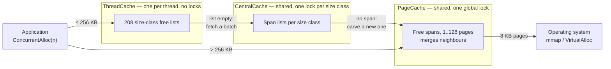
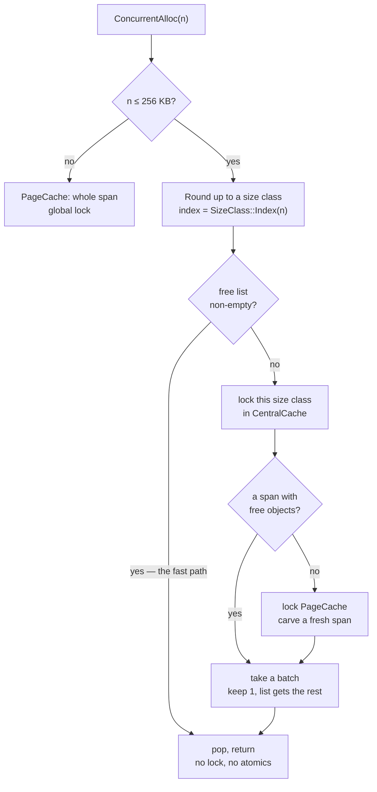

# A thread-caching memory allocator

A from-scratch `malloc` replacement in C++, built along the lines of Google's
**tcmalloc**: per-thread free lists on the fast path, batched refills through a
shared middle layer, and a page-level backend that talks straight to the OS.

About **1 200 lines** across 12 files, plus a benchmark harness. Solo project
(Northeastern CS5600, Nov 2025).

The interesting part is not that it beats the system allocator on a benchmark.
It is **which** benchmarks it wins, which it loses, and what that says about
where the speed actually comes from — the answer turned out not to be the one I
set out to demonstrate.

---

## Architecture

Three layers. An allocation is served by the shallowest one that can satisfy it,
and only the deepest layer ever asks the OS for memory.



| Layer | Scope | Synchronisation | Job |
| --- | --- | --- | --- |
| `ThreadCache` | per thread | **none** | Pop/push a free list. The whole point. |
| `CentralCache` | global | one mutex **per size class** | Hand out batches of objects carved from spans. |
| `PageCache` | global | one global mutex | Get pages from the OS, split and merge spans. |

The layering is what makes the fast path lock-free: a thread only reaches shared
state when its own free list runs dry, and when it does, it takes enough objects
to amortise the trip.

### The fast path, and what it costs to miss it



Two details worth calling out.

**Batched refills with slow start.** When a free list is empty the thread does
not fetch one object, it fetches a batch — and the batch size grows each time
that list is refilled (`MaxSize()` climbs by one per refill). A thread that
allocates a handful of objects never pays for a large transfer; a thread in a hot
loop converges on large ones. Same idea as TCP slow start.

**Size classes trade a little memory for a lot of speed.** 208 classes with
alignment that widens as sizes grow, so the worst-case waste stays near 12%:

```
     1 ..   128 B   ->  8 B alignment    16 classes
   129 .. 1024 B    -> 16 B alignment    56 classes
  1 KB ..    8 KB   -> 128 B alignment   56 classes
  8 KB ..   64 KB   ->   1 KB alignment  56 classes
 64 KB ..  256 KB   ->   8 KB alignment  24 classes
      > 256 KB      -> whole pages, straight to PageCache
```

Rounding to a class is a couple of shifts, so both `Index` and `RoundUp` are
branch-on-magnitude then arithmetic — no search.

### Spans, and how a pointer finds its way home

A **span** is a run of consecutive 8 KB pages. `CentralCache` chops a span into
equal objects of one size class; `PageCache` owns whole spans and merges
neighbours back together as they are freed, which is what stops the heap
fragmenting into unusable gaps.

```
span: 4 pages, size class 128 B
+--------+--------+--------+--------+
| page N | page+1 | page+2 | page+3 |
+--------+--------+--------+--------+
 \___________________________________/
   sliced into 256 objects, threaded
   onto a singly-linked free list

free(p) has no size argument, so:

  pageId = (uintptr_t)p >> 13   ------>  page map  ------>  Span*
                                                              |
                                                    span->_objSize
                                                    tells us the size class
```

`free` receives only a pointer, so the allocator has to recover the size itself.
Every page belongs to exactly one span, so shifting the pointer down by the page
size gives a key into a **page map** that returns the owning span — and the span
records its object size. That lookup happens on **every** deallocation, which
makes it the single hottest data structure in the design. It is also where the
port went wrong.

---

## Porting it to 64-bit broke it, instructively

The project was originally built 32-bit on Windows (`-A Win32`). Moving it to
64-bit macOS/Linux took the obvious changes — `mmap`/`munmap` for
`VirtualAlloc`/`VirtualFree`, `thread_local` for `_declspec(thread)`, a 64-bit
`PAGE_ID` — and then it segfaulted on the first `free`.

The page map was this:

```cpp
TCMalloc_PageMap1<32 - PAGE_SHIFT> _idSpanMap;   // 2^19 entries, flat array
```

A flat array of 2^19 slots covers page IDs 0 through 2^19, which is the low
**4 GB** of address space. On a 32-bit build that is the entire address space. On
a 64-bit host `mmap` returns addresses well above 4 GB, every page ID fails the
array's bound check, `get()` returns null for perfectly valid pointers, and the
first deallocation dereferences it.

The fix is the one real tcmalloc makes: choose the map's depth from the width of
the address space. With 48-bit user addresses and 8 KB pages there are 2^35 page
IDs to cover. A two-level split puts 2^18 entries in a leaf — **2 MB per node**,
which then tripped a second bug, because `ObjectPool` refills in fixed 128 KB
chunks and hands out a 2 MB object from a 128 KB block without complaint. So:
**three levels**, 12/12/11 bits, every node 16–32 KB, allocated lazily and
straight from the OS rather than through the pool.

Node pointers are `std::atomic` with release stores and acquire loads. `get()`
runs on the free path without the `PageCache` lock, so it can genuinely race a
concurrent `set()`; nodes are never freed, so a published pointer stays valid,
and the acquire/release pairing is what guarantees a reader that sees a node also
sees its zeroed contents.

Two other real bugs surfaced on the way:

- `FetchFromCentralCache` fell off the end of a non-`void` function when its
  batch came back empty. An `assert` covered the case in debug builds and
  vanished under `-DNDEBUG`, leaving undefined behaviour in exactly the
  configuration you benchmark.
- Headers were included before the declarations their templates depended on.
  MSVC accepts this; clang and GCC correctly do not.

---

## What the measurements actually show

Full tables and commands in [BENCHMARKS.md](BENCHMARKS.md). Apple M3 Pro, macOS,
baseline is **macOS libmalloc**, wall clock, median of 15 runs, warm-up
discarded.

An earlier round of this project measured against the **Windows CRT** allocator
and reported up to 22.8x. That number is not wrong so much as uninformative: the
Windows CRT heap serialises on a global lock and is the weakest baseline
available. libmalloc already keeps per-thread magazines, so it is a real
opponent. Every figure below is against libmalloc.

### Finding 1 — the speed is in the fast path, not in avoiding locks

| threads | speedup |
| --- | --- |
| 1 | 3.82x |
| 2 | 3.93x |
| 4 | 4.65x |
| 8 | 4.97x |

I built this expecting to demonstrate that per-thread caching wins by removing
lock contention. If that were the mechanism, one thread would show roughly no
advantage and the gap would open up with concurrency.

Instead **3.82x of the final 4.97x is already present at a single thread**, where
there is no contention to remove. Going from 1 to 8 threads adds about 30%. Most
of the win is simply that popping a pointer off a thread-local list is cheaper
per call than what libmalloc does — the concurrency story is the smaller half.

Getting this right required a single-threaded baseline, which the original
experiments did not have. It is the measurement that changed the conclusion.

### Finding 2 — it loses on the pattern real programs use

| pattern (4 threads, 1 B–8 KB) | speedup |
| --- | --- |
| allocate 10 000, then free all | 4.42x |
| **bounded 64-object live set** | **0.77x** |
| thread N frees thread N+1's memory | 2.50x |

The benchmark this allocator was tuned against allocates ten thousand objects and
then frees all of them. That is close to the best case for a thread-local design:
every object returns to the list it came from, and the next round finds those
lists full.

Switch to a bounded live set — allocate, free something older, repeat, which is
what most programs actually do — and **it comes out 23% slower than libmalloc**.
The fast path stops being the common case, and every `free` still pays for the
three-level page-map walk to recover the object's size. libmalloc keeps size
metadata next to the block and skips that entirely.

Part of that cost is self-inflicted: the flat one-level map would have been a
single load, and it is only the 64-bit port that made the lookup a three-level
descent. But the flat map cannot address a 64-bit heap at all, so the tradeoff
is not optional.

### Finding 3 — walking sizes in order is a size-class treadmill

| size pattern | bulk | interleaved |
| --- | --- | --- |
| fixed 16 B | 1.10x | 2.78x |
| **ramp** (sizes in order) | 4.83x | **0.78x** |
| **random** (same range) | 4.25x | **3.54x** |

`ramp` and `random` draw from the same 1 B–8 KB range, so they ought to behave
alike. Under `bulk` they do. Under `interleaved` they diverge by 4.5x, and the
reason is instructive.

The ramp visits sizes in ascending order, so a 64-object window spans 64
*consecutive and distinct* size classes. Each class is touched once and then left
behind as the ramp moves on — its free list is refilled from `CentralCache` and
then never reused. Random sizes keep landing back in the same ~130 classes, so
those lists get hit over and over and the fast path works as designed.

The original benchmark called its ramp "random-sized allocations". It is worth
being precise about that, because a deterministic ascending sweep is not a
neutral workload for a size-class allocator — it flatters the design under
`bulk` and punishes it under `interleaved`.

### Finding 4 — the memory cost is much larger than "some overhead"

Peak RSS, one allocator per process:

| size / pattern | ours | libmalloc | ratio |
| --- | --- | --- | --- |
| fixed 16 B / interleaved | 2.8 MB | 2.6 MB | 1.08x |
| ramp / bulk | 221 MB | 136 MB | 1.63x |
| **ramp / interleaved** | **128 MB** | **11 MB** | **11.58x** |

The same treadmill shows up as memory. Roughly 130 size classes each accumulate a
free list that is never drawn from again, and `PageCache` only returns a span to
the OS when it is 128 pages or larger — so for this workload nothing is ever
given back. libmalloc holds 11 MB for the same 64 live objects.

For a single size class the overhead is nil (1.08x). The cost is not per-thread
caching as such; it is **size-class spread with no reclamation**.

---

## Where real tcmalloc goes further

The core ideas here are the real ones — thread-local free lists, slow-start
batching, per-size-class locks, span merging, page-to-span mapping. What
production tcmalloc adds, mapped onto the problems the measurements above found:

| Mechanism | Problem it solves | Here |
| --- | --- | --- |
| **Per-CPU caches** (restartable sequences) | Cache count scales with cores, not threads — the main lever on Finding 4 | per-thread |
| **Returning memory to the OS** | Idle free lists and spans stop being resident | only spans >1 MB |
| **Transfer cache** | Smooths cross-thread frees so neither side keeps hitting the central layer | absent (Finding 2's 2.50x) |
| **Adaptive cache sizing / periodic scavenging** | Free lists a workload has stopped using shrink back | `MaxSize()` only grows |
| **Sized delete** (`operator delete(p, n)`) | Skips the page-map lookup when the caller knows the size — directly attacks Finding 2 | always looks up |
| **Hugepage-aware backend** (Temeraire) | Fewer TLB misses on large heaps | 8 KB pages |
| **Sampling heap profiler** | Attributing allocations in production | absent |

---

## Build and run

Needs a C++14 compiler. No dependencies.

```bash
c++ -std=c++14 -O2 -DNDEBUG -pthread -o bench \
    main.cpp CentralCache.cpp PageCache.cpp ThreadCache.cpp
```

```bash
./bench --help
./bench --threads 4 --size ramp --pattern bulk --reps 15
./bench --threads 1 --size random --pattern interleaved   # the case it loses
./bench --size ramp --pattern interleaved --only mine     # peak RSS in isolation
```

| Flag | Meaning |
| --- | --- |
| `--threads N` | worker threads |
| `--rounds N` / `--ntimes N` | rounds per thread / allocations per round |
| `--reps N` | repetitions, reported as median + standard deviation |
| `--size` | `fixed` \| `ramp` \| `random` \| `large` |
| `--pattern` | `bulk` \| `interleaved` \| `cross` |
| `--only` | `mine` \| `sys` \| `both` — one allocator per process, for RSS |
| `--csv` | machine-readable output |

Worth building with sanitizers before trusting any timing — an allocator that is
fast and subtly wrong is worthless:

```bash
c++ -std=c++14 -O1 -g -pthread -fsanitize=address \
    -o bench_asan main.cpp CentralCache.cpp PageCache.cpp ThreadCache.cpp
./bench_asan --threads 4 --rounds 3 --ntimes 300 --pattern cross
```

---

## Limitations

Course project, not a drop-in allocator:

- **Not a `malloc` replacement.** It is called explicitly as
  `ConcurrentAlloc`/`ConcurrentFree`. There is no `operator new` override, no
  `LD_PRELOAD` shim, and no `realloc`, `calloc`, `posix_memalign`, or
  `malloc_usable_size`.
- **No alignment guarantees beyond 8 bytes.** No over-aligned type support.
- **Memory is essentially never returned to the OS** — only spans of 128+ pages.
  Finding 4 is the consequence.
- **Slower than the system allocator on bounded-live-set workloads**, which is
  most real code. Finding 2.
- **No unit tests.** Correctness was checked with AddressSanitizer and
  assert-enabled debug builds across the workload matrix, which is not the same
  thing as a test suite.
- **The page map's lock-free reads are only safe because nodes are never freed.**
  Adding reclamation would need real memory ordering work or hazard pointers.
- **Single machine, single baseline.** All numbers are one Apple M3 Pro against
  macOS libmalloc. glibc's ptmalloc, jemalloc, mimalloc and real tcmalloc would
  all behave differently, and the honest comparison for a "tcmalloc-style"
  allocator is against tcmalloc itself — which I have not run.
- **`libmalloc`'s run-to-run variance is high** (standard deviation often 30–50%
  of its median under load) even with warm-up and alternated ordering. Medians
  over 15 repetitions are reported for that reason; single runs are not
  meaningful.
