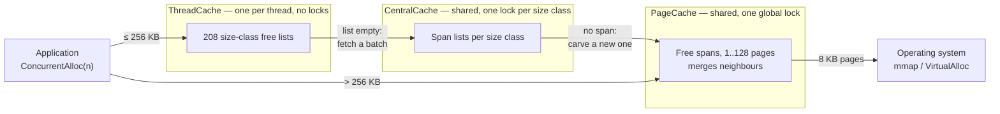

# A thread-caching memory allocator

A three-layer allocator in C++14, measured against **five baseline allocators on
three operating systems**.

The design rests on a single decision — **a private cache per thread, which almost
never returns memory to the operating system** — and every strength and every
weakness below is one of the two faces of that decision.

| | |
| --- | --- |
| Per-call cost | **2.67 ns** against libmalloc's 4.94 ns (one thread, 16 bytes) |
| Best workload | `ramp/bulk` at **4.51x** (9.52x on Windows) |
| Worst workload | `large/interleaved` at **0.047x** — 0.02x at eight threads |
| Peak RSS | **22.5x** libmalloc, **214x** the application's live data |
| p99.9 latency | **11.2x** libmalloc |
| Against a real peer | tcmalloc on Linux is **2.7x faster** on a fifth of the memory |

Those last two rows are the point. This is not a project about implementing
tcmalloc and finding it fast. It is a project about **pricing each simplification
separately**.

---

## 1. Architecture

Three layers. An allocation is served by the shallowest one that can satisfy it,
and only the deepest layer ever asks the OS for memory.



| Layer | Scope | Synchronisation | Job |
| --- | --- | --- | --- |
| `ThreadCache` | per thread | **none** | Pop/push a free list. The whole point. |
| `CentralCache` | global | one mutex **per size class** | Hand out batches of objects carved from spans. |
| `PageCache` | global | **one** global mutex | Get pages from the OS, split and merge spans. |

The layering is what makes the fast path lock-free: a thread only reaches shared
state when its own free list runs dry, and when it does, it takes enough objects
to amortise the trip.

**Note the last edge.** `> 256 KB` lands directly on `PageCache`'s global lock,
bypassing the thread cache entirely. That edge is this project's largest single
weakness, and section 6 comes back to settle the bill.

### Size classes and the page map

Requested sizes round up into **208 size classes** — 8-byte alignment below
128 bytes, 16 below 1 KB, 128 below 8 KB, and so on. The alignment granularity is a
real design knob; section 5.6 is an experiment that changes it.

A free receives only a pointer, so it must be possible to **find the span a pointer
belongs to**. A three-level radix tree does that: the page ID is `address >> 13`,
split 12/12/11 bits, with nodes allocated lazily at 16–32 KB each. Reads take no
lock — nodes are never freed once published, and acquire/release pairing
guarantees a reader that sees a node also sees its zeroed contents — because that
lookup sits on every single `free`.

### One porting bug, and why it is worth writing down

The project was originally a 32-bit Windows build. Moving it to 64-bit took the
obvious changes — `mmap` for `VirtualAlloc`, `thread_local` for
`__declspec(thread)`, a 64-bit `PAGE_ID` — and then it segfaulted **on the first
`free`**.

The page map was a flat array of `2^19` entries, which covers the low **4 GB** of
address space. On a 32-bit build that is the entire address space. On a 64-bit host
`mmap` returns addresses well above 4 GB, so **every page ID for a perfectly valid
pointer fails the bound check**, the lookup returns null, and the first
deallocation dereferences it.

The fix is the one real tcmalloc makes: choose the tree's depth from the width of
the address space. That surfaced a second bug — a two-level split puts 2 MB in each
leaf, and `ObjectPool` refills in fixed 128 KB chunks and will **hand out a 2 MB
object from a 128 KB block without complaint**. Hence three levels.

Two others worth recording:

- `FetchFromCentralCache` **fell off the end of a non-`void` function** when its
  batch came back empty. An `assert` covered it in debug builds and vanished under
  `-DNDEBUG` — so the undefined behaviour existed *only* in the configuration you
  benchmark.
- Headers were included before the declarations their templates depended on. MSVC
  accepts this; clang and GCC correctly do not.

Details in BENCHMARKS.md section P.

---

## 2. How an allocation works

**The fast path (≤ 256 KB, 95–99% of calls):**

1. Read the thread-local `ThreadCache` pointer
2. Turn the requested size into a size-class index
3. If that free list is non-empty — `pop`, return

No atomics, no locks, no syscalls. Roughly a dozen instructions in the
disassembly.

**Missing the fast path is a cascade:**

list empty → take the `CentralCache` lock for that size class → if no span is
available, take `PageCache`'s global lock → if no suitable free span, `mmap` a new
one.

A local `pop` costs about **2 ns**; a round trip to `CentralCache` about **70 ns** —
a factor of 35. So "fast-path hit rate" is not a decorative metric, it *is* the
performance. A refill takes a whole batch, and the batch size grows by one per
refill for that class (slow start), to amortise the trip.

**The path above 256 KB is a different design entirely:** take `PageCache`'s global
lock, `mmap` directly. No cache, no batching, nothing per-thread.

---

## 3. How a free works

`ConcurrentFree(void* ptr)` **takes only the pointer** — it does not ask the caller
to remember the size. So the first step is the page-map lookup: pointer → span →
`span->_objSize`.

With the size in hand:

1. Above 256 KB — take `PageCache`'s global lock, return the whole span
2. Otherwise push onto this thread's list for that class
3. If that list grows past its cap, return a batch **to** `CentralCache`
4. When every object carved from a span has come back, the span returns to
   `PageCache` and merges with its free neighbours

**The point is that step 5 does not exist.** `PageCache` only reaches `munmap` for
spans of 128 pages (1 MB) or more. For a workload whose objects are all ≤ 8 KB,
**nothing is ever given back**, and peak RSS becomes a high-water mark for the life
of the process.

This is a deliberate choice rather than an oversight — and it is the *same* source
as both the largest win and the largest memory cost in section 6.

---

## 4. How it was measured

The harness (`main.cpp`) alternates two allocators in one process, with
configurable thread count, rounds, size distribution and access pattern, and
reports peak RSS, minor faults and per-call latency percentiles separately.

**Size distributions** `fixed` (16 B) · `ramp` (1 B–8 KB ascending) · `random` (same
range) · `classstep` (every call in a different size class) · `large` (> 256 KB)
**Access patterns** `bulk` (allocate all, then free all) · `interleaved` (a rolling
window of 64 live objects) · `cross` (thread N frees what thread N+1 allocated)

**Five baselines across three operating systems:** Windows UCRT, macOS libmalloc,
glibc ptmalloc, mimalloc, and real gperftools tcmalloc.

### The correctness gate, and why ASan is not one

A README that reports performance without saying how correctness was established is
suspect. The gate here is `verify.cpp`: it stamps every block with a verifiable
pattern and counts four classes of failure — null returns, misalignment, corrupted
stamps (a block handed out twice or short), and double frees.

It runs the 12 size-by-pattern combinations plus a **size-boundary pass** that walks
both sides of every size-class transition, from a zero-byte request up past the
256 KB threshold where allocations bypass the thread cache. The workload loops sweep
sizes but never reach the ends of the range, so they cannot see an off-by-one in the
size-class table — which is how a `ConcurrentAlloc(0)` crash survived until the
boundary pass was added.

**AddressSanitizer is nearly useless for this.** A custom allocator's free lists are
opaque to it — there is not one `ASAN_POISON` annotation in the project — so it
cannot see inside them. Measured: on a deliberately broken allocator, **ASan
reports 0 errors and `verify.cpp` catches 12**.

The gate itself needs verifying: `--alloc broken` must FAIL on **every** row, and
`--alloc sys` must pass on every row. Both are checked; getting the negative control
wrong is easy — widening its slab to fit the boundary pass silently stopped small
allocations from colliding, and one row started passing when it should not.

### Three methodological rules

- **A single measurement is not trustworthy** (±25% on this machine). Every headline
  figure is a **median of ≥5 independent processes**, reported with its range.
- **Memory must be measured one allocator per process.** `ru_maxrss` and
  `PeakWorkingSet` are process-wide monotonic high-water marks; two allocators in
  one process makes the number meaningless.
- **Swapping allocators requires positive verification.** Each of the three
  platforms has its own **silent failure**: on macOS, linking `-ltcmalloc` silently
  takes over `malloc`; on Linux, `--as-needed` silently drops the library; on
  Windows, a static CRT (`/MT`) lets the injection "succeed" while every call still
  goes to the CRT. Each of these once turned a whole batch of data into a
  measurement of something else.

---

## 5. Results

macOS figures are an Apple M3 Pro on macOS 15, 4 threads, medians of 15 independent
processes. Linux is a 4-core Ubuntu 22.04 aarch64 VM; Windows is a Ryzen 7 7700X on
Win10 x64. Full section-by-section record in BENCHMARKS.md.

### 5.1 Against system allocators

`> 1` means this allocator is faster.

| workload | Windows UCRT | macOS libmalloc | glibc ptmalloc |
| --- | --- | --- | --- |
| `ramp/bulk` | **9.52x** | **4.51x** | **5.10x** |
| `classstep/interleaved` | **22.82x** | **3.80x** | **9.38x** |
| `random/interleaved` | — | **3.21x** | — |
| `fixed/interleaved` | **2.59x** | **1.47x** | 0.63x |
| `ramp/interleaved` | **1.77x** | 0.83x | **1.14x** |
| `fixed/bulk` | **1.35x** | 0.35x | 0.30x |
| `large/interleaved` | — | **0.047x** | — |

### 5.2 Against modern peers

| workload | mimalloc (Win) | real tcmalloc |
| --- | --- | --- |
| `ramp/bulk` | 1.01x (tie) | **1.43x** |
| `classstep/interleaved` | 0.91x | 0.74x |
| `fixed/interleaved` | 0.57x | 0.72x |
| `ramp/interleaved` | 0.49x | 0.41x |
| `fixed/bulk` | 0.24x | 0.45x |

**The win count falls as the baseline improves:** Windows UCRT **5 of 5** → macOS
libmalloc **3 of 5** → glibc **3 of 5** → mimalloc **1 of 5** → real tcmalloc **1 of
5**, and that one is a 1.01x tie.

Winning everything against UCRT describes UCRT's position, not this allocator's.
That **22.82x** is the least informative number in the whole project — change the
baseline and it becomes 0.74x.

### 5.3 Its position is more stable across platforms than across workloads

The sharpest result here:

| | how far one workload swings between operating systems |
| --- | --- |
| against the **shipped system** malloc | median **2.4x** (up to 4.5x) |
| against the **same build** of real tcmalloc | **1.3x** |

And `classstep/interleaved` against real tcmalloc is **0.74x on both Linux and
Windows, identically**.

**The variance was never on this allocator's side** — it was in how far apart the
shipped system allocators are from each other.

### 5.4 Memory — the most serious defect

Peak RSS, one allocator per process:

| workload | this allocator | libmalloc | ratio |
| --- | --- | --- | --- |
| `fixed/interleaved` | 3.0 MB | 2.9 MB | 1.0x |
| `ramp/bulk` | 252 MB | 123 MB | 2.1x |
| `random/interleaved` | 72 MB | 11 MB | 6.5x |
| `classstep/interleaved` | 91 MB | 7.9 MB | 11.6x |
| **`ramp/interleaved`** | **186 MB** | **8.3 MB** | **22.5x** |

In that last row the application's live data is **0.87 MB**. libmalloc holds 9x it;
this allocator holds **214x** it. Real tcmalloc, on Linux, holds 22 MB for the
equivalent work — **while being faster**.

**It is not size-class rounding waste.** That is 1.5%, about 0.04 MB. The four real
causes:

1. **Free lists only ever grow.** The cap rises by one per refill and **no code path
   anywhere** decreases it. A size class the workload touched once during a burst
   keeps its capacity for the life of the process.
2. **One live object pins a whole span.** A span returns only when its `_useCount`
   hits zero. With ~130 classes active, each holding a 31–32 page (~250 KB) span
   with a couple of objects still out, the pinned total is tens of megabytes.
3. **`PageCache` almost never gives anything back.** Only spans of 128+ pages reach
   `munmap`.
4. **The sheer number of size classes** (see 5.6).

### 5.5 Tail latency

Per-call sampling (about one call in 16, randomised so it cannot alias with
periodic slow paths), `ramp/interleaved`:

| | p99 | p99.9 |
| --- | --- | --- |
| this allocator | 361 ns | **2 631 ns** |
| libmalloc | 70 ns | **235 ns** |

**Tail latency is not a separate win; it follows the fast-path hit rate.** On
workloads that stay on the fast path (`random/interleaved`) the tail is *better*
than libmalloc's; fall off it and the gap is an order of magnitude. The slow path
is a cascade — list empty, then the `CentralCache` lock, then the `PageCache` lock,
then possibly an `mmap` — and an ascending-size workload triggers it continuously.

### 5.6 The one loss is a constant, not the design

`ramp/interleaved` — ascending sizes with a bounded live set — is the only workload
that loses to libmalloc. The diagnosis is two halves, one on each side.

**Our half.** Ascending sizes put each size class into a drain-then-pile cycle. The
pile reaches ~64 objects against a cap of ~19, so it cannot be held locally:
**87 `CentralCache` round trips per 1 000 allocations**, against 18 for random
sizes.

**libmalloc's half.** Measured with `malloc_size()`: from 1 KB to 8 KB — 87% of this
workload's range — **it quantises to 512 bytes and we quantise to 128**. Its buckets
are 4x coarser, the ramp lingers 4x longer in each, and the same penalty is spread
over 4x more allocations.

**So: change our granularity to match its.**

| | 128 bytes | 512 bytes |
| --- | --- | --- |
| `ramp/interleaved` | 0.80x [0.64–0.90] | **1.26x [1.12–1.43]** |
| its peak RSS | 186 MB (22.5x) | **80 MB (9.7x)** |
| its p99.9 | 2 631 ns | **528 ns** |
| central trips per 1 000 allocs | 87 | 50 |
| cost: `ramp/bulk` / `ramp/cross` | 4.46x / 2.52x | **3.39x / 1.89x** |

The confidence ranges on the first row do not overlap. This is the only one of three
attempted interventions that is net positive — and its strongest evidence is not the
result but the forecast: the cost model BENCHMARKS.md section E fitted **before this
configuration existed** (2 ns per allocation + 70 ns per central trip) predicts the
new time to **+4.6%**.

The cost has a mechanism too. With four times fewer classes each class owns four
times more of the live objects, so a span is far more likely to drain completely,
return to `PageCache`, and be re-carved. **Recycling is why the memory falls;
re-carving is why `bulk` slows down** — one fact, two faces.

The change ships as a compile-time knob, `-DMID_ALIGN_SHIFT=9`, **off by default**
(every other number in this project was measured at 128). BENCHMARKS.md section W.

---

## 6. What the data says

### The core trade

**A per-thread cache that never returns memory.** All five results below come from
that one decision:

| one face of the decision | result |
| --- | --- |
| the fast path is short | 1.85x cheaper per call ✅ |
| never return → pages need no re-faulting | `bulk` workloads win 4.5–9.5x ✅ |
| never return → the high-water mark *is* the peak | 22.5x memory ❌ |
| a cache miss is a cascade | 11.2x worse p99.9 ❌ |
| a cache has to warm up | 3x cold-start penalty ❌ |

Strengths and weaknesses are not two lists; they are two faces of one trade. It is
sharpest on `ramp/bulk`: **hoarding wins 4.5x there and costs 22.5x memory on
`ramp/interleaved` — same policy, same code, nothing changed.**

### Strengths

**① It is fast because the fast path is short, not because it avoids locks.**

Measured at one thread: **2.67 ns against 4.94 ns, 1.85x**. And the advantage is
**largest at one thread and decays monotonically with concurrency**:

| threads | 1 | 2 | 4 | 8 |
| --- | --- | --- | --- | --- |
| advantage | **3.04x** | 2.62x | 2.26x | **1.82x** |

That is the *opposite* of what a "lock-free design wins under contention" story
predicts. Lock freedom is a by-product of this structure, not the source of the
gain.

⚠️ And the honest part: after ruling each candidate out by measurement — atomics
(free), a real mutex (costs more than the entire gap, so it cannot be there), zone
dispatch (below the noise floor), and the contract work a real `malloc` must do
(`malloc(0)`, `free(NULL)`, free-list integrity checks, all at or below the noise
floor) — **about 2 ns remains unattributed**. The advantage is real and reproducible;
its mechanism is only a third explained.

**② Never returning memory is a throughput strategy, and it works.**

The `bulk` wins are **not allocation speed, they are page faults.** Minor faults per
1 000 operations:

| | this allocator | libmalloc | glibc |
| --- | --- | --- | --- |
| `ramp/bulk` | **9.3** | 223 | **642** |

The opponents gave memory back, so the next round has to fault it in again. This
allocator does not, so it does not pay. **Same policy, billed at 22.5x in 5.4.**

**③ The size of the advantage is a property of the opponent, not of this code.**

See 5.2 — the win count falls monotonically from 5 of 5 to 1 of 5. Any figure
against a single baseline is mostly a description of that baseline.

### Weaknesses

**① It hoards.** 22.5x peak RSS, 214x the live set, from four causes, none of them
fragmentation inside a block. The fix is not to stop hoarding but to add a
scavenger — which is what real tcmalloc has, and why it holds 22 MB at higher speed.
An attempt to raise the cache capacity *without* adding reclamation made **both axes
worse** (BENCHMARKS.md section O), which is the same lesson from the other
direction.

**② Where there is no fast path, locking is everything.**

Above 256 KB there is no thread cache at all — every allocation and every free takes
the same `PageCache` global mutex. The cost degrades **quadratically** in thread
count:

| threads | 1 | 2 | 4 | 8 |
| --- | --- | --- | --- | --- |
| `large/interleaved` | 0.52x | 0.15x | **0.04x** | **0.02x** |

The same size distribution is a **2.34x win at one thread** (`large/bulk`), so what
is slow is not the allocation logic — it is lock-contention collapse.

**Together with strength ① this is the complete statement about locks: locking
matters enormously — but only in the one place this design forgot to put a cache.**

**③ Tail latency follows the fast path.** 11.2x worse at p99.9. There is no
independent "more predictable" property to claim.

**④ Cold start costs 3x.** `--warmup 0` measures 0.32x. The cache has to warm up,
and a short-lived process never gets there.

**⑤ Against a real peer it loses.** On Linux, real tcmalloc runs `ramp/interleaved`
in **1.60 ms** against this allocator's 4.33 ms and glibc's 7.50 ms. **It is 2.7x
faster on a fifth of the memory.** The core ideas — thread-local free lists, slow
start batching, per-size-class locks, span merging, page-to-span mapping — are the
right ones. The gap is the price of the simplifications, and that price is now
itemised.

---

## 7. When to use it, and when not to

| use this | use the system allocator |
| --- | --- |
| long-running process, so the 3x cold start amortises | short-lived process — a CLI tool or test runner never pays it off |
| memory is plentiful; you can absorb 22x resident | memory is constrained — that alone disqualifies it |
| the live set is large and cyclic: allocate a batch, free it all, repeat | the live set is bounded and sizes advance in order |
| every object is ≤ 256 KB | anything above 256 KB, especially multi-threaded |
| the hot loop is allocation-dominated | there is real work between allocations — a 1 ns edge vanishes into it |
| you can call `ConcurrentAlloc`/`ConcurrentFree` explicitly | you need the actual `malloc` contract |

**And the honest bottom line: in production you would pick neither.** The per-call
advantage is 1.85x on an operation costing about 2 ns — roughly **one nanosecond** —
which disappears behind any real work between allocations. Real tcmalloc beats both
on Linux, mimalloc wins 4 of 5 workloads on Windows, and both are genuine drop-in
replacements.

The value of this comparison is not a deployment decision. It is that the cost of
the "per-thread cache, never give memory back" trade is now quantified on both
sides: **about one nanosecond and one page fault saved per call, against 22x memory,
11x tail latency, 3x cold start, and quadratic collapse above 256 KB.**

---

## 8. Limitations

A course project, not a usable allocator:

- **Not a `malloc` replacement.** Called explicitly as
  `ConcurrentAlloc`/`ConcurrentFree`; no `operator new` override, no `LD_PRELOAD`
  shim, and no `realloc`, `calloc`, `posix_memalign` or `malloc_usable_size`.
- **No alignment guarantee beyond 8 bytes.** No over-aligned type support.
- **Memory is essentially never returned to the OS** — only spans of 128+ pages.
  Section 5.4 is the consequence.
- **No cache whatsoever above 256 KB.** Weakness ② is the consequence.
- **No unit tests.** Correctness is checked by `verify.cpp` and assert-enabled builds
  across the workload matrix, which is not the same thing as a test suite.
- **The page map's lock-free reads are only safe because nodes are never freed.**
  Adding reclamation would need real memory-ordering work or hazard pointers.
- **Five baselines and three platforms is still not enough.** jemalloc is not
  measured. **Modern google/tcmalloc with per-CPU caches** (restartable sequences) —
  the mechanism this document keeps citing as the fix for the memory problem — is
  **not measured**: it needs Bazel and is Linux-only.
- **Some `cross` and `large` configurations have only single or few measurements.**

---

## 9. Build and run

```bash
c++ -std=c++14 -O2 -DNDEBUG -pthread -o bench \
    main.cpp CentralCache.cpp PageCache.cpp ThreadCache.cpp
```

**Run the correctness gate before looking at any timing:**

```bash
c++ -std=c++14 -O2 -DNDEBUG -pthread -o verify \
    verify.cpp CentralCache.cpp PageCache.cpp ThreadCache.cpp
./verify --alloc mine   --all    # must pass
./verify --alloc broken --all    # must fail, or the gate proves nothing
```

```bash
./bench --help
./bench --threads 4 --size ramp --pattern bulk --reps 15
./bench --size ramp --pattern interleaved --only mine     # peak RSS in isolation
./bench --latency --lat-stride 16 --size ramp --pattern interleaved
```

| Compile-time define | Effect |
| --- | --- |
| `-DALLOC_STATS` | internal counters — fast-path rate, refills, flushes, spans carved |
| `-DMID_ALIGN_SHIFT=9` | 512-byte alignment for the 1 KB–8 KB size classes (section 5.6). Off by default |

⚠️ **On macOS, check `MallocNanoZone` before measuring.** If it is set to `0` — some
tool environments do this — libmalloc's nano front-end for small allocations is
disabled and the baseline runs 1.4–2.2x slower at the 16-byte scale. Use
`env -u MallocNanoZone` to get the real default behaviour. BENCHMARKS.md section X.

---

The full section-by-section record — every reproducible command, and every
intermediate conclusion that was later refuted or corrected — is in
**BENCHMARKS.md** (sections A–X).
